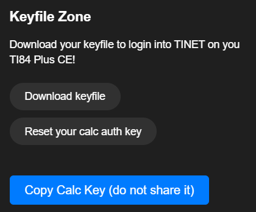
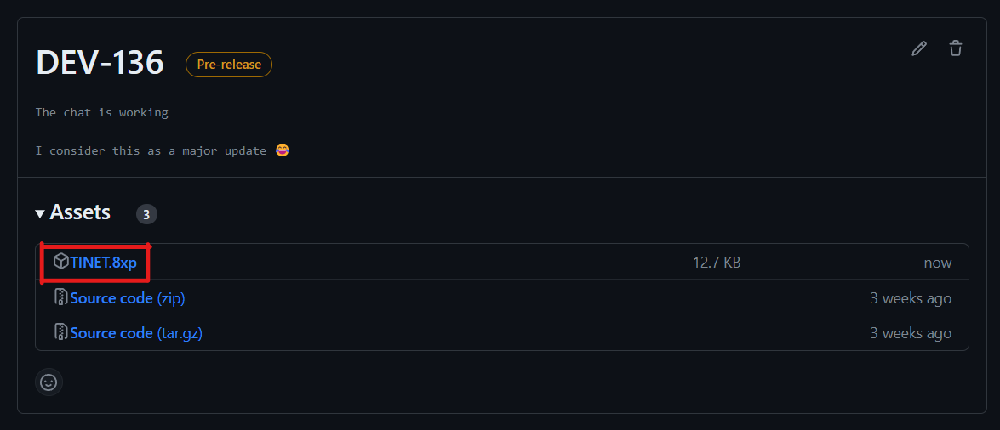

# ⬇ Installation


**If you are on Windows, please make sure to have the correct drivers installed for the bridge to work!**



If you are on TI OS 5.5.3 or higher please install the [arTIfiCE](https://yvantt.github.io/arTIfiCE/) "jailbreak"


* Create an account [here](https://tinet.tkbstudios.com/register).
* Then on the dashboard download your keyfile.

<figure><figcaption>
Where to download the keyfile on the dashboard
</figcaption></figure>


Be sure not to share your keyfile with anyone as it contains your login credentials (username and calc key which is not your password but could still allow people to log into your account).


* Download [clibs.8xg](https://github.com/CE-Programming/libraries/releases/latest)
* Download the latest release of the [client](https://github.com/tkbstudios/tinet-calc/releases) and [bridge](https://github.com/tkbstudios/tinet-bridge/tree/master).\
  On Linux, the bridge can be cloned easily using\
  `git clone https://github.com/tkbstudios/tinet-bridge` for the main branch.\
  `git clone -b dev https://github.com/tkbstudios/tinet-bridge` for the dev branch.

<figure><figcaption>
Download TINET.8xp from the release you want
</figcaption></figure>


Dev (DEV-x) versions are the most updated but are not guaranteed to be stable like stable versions (Vx.x.x).

They also offer a lot of bug fixes to known bugs in Stable releases.

You choose which release you want, we still recommend you choose.


***

## How to transfer over the files.



The easiest way on Windows (7, 8, 10, 11) is to use [TI-Connect CE](https://education.ti.com/en/products/computer-software/ti-connect-ce-sw)

Another method is using [TiLP](http://lpg.ticalc.org/prj\_tilp/).&#x20;

[ticalc.link](https://ticalc.link/) is not a recommended method on Windows as there are many driver issues.



The easiest method to transfer files on Linux is to use [TiLP](http://lpg.ticalc.org/prj\_tilp/) or [ticalc.link](https://ticalc.link/). Note that ticalc.link only works with compatible WebSerial browsers like Google Chrome.



Currently you can use [TiLP](http://lpg.ticalc.org/prj\_tilp/) on MacOS , [ticalc.link](https://ticalc.link/), and [TI Connect CE](https://education.ti.com/en/products/computer-software/ti-connect-ce-sw).



On Chrome OS you can use [ticalc.link](https://ticalc.link/) or [TI Connect CE for Chrome OS](https://chrome.google.com/webstore/detail/ti-connect-ce-app-for-chr/aokihcpccmdjjkebakdanncddpdnkfla) both of these options are known to be buggy. If you have Linux on your Chromebook you should be able to use [TiLP](http://lpg.ticalc.org/prj\_tilp/).




Please make sure that you have Python 3.11 (Or 3.12 beta) and pip3. Python can be installed on Windows at the Microsoft Store [here](https://apps.microsoft.com/store/detail/python-311/9NRWMJP3717K) (recommended) or from python.org [here](https://www.python.org/downloads/).\
On Linux Python can be installed with:\
`sudo apt install python3 python3-pip`


* Navigate to your folder containing the extracted or cloned repository.
* Run this command in that directory/folder to install the required Python dependencies. `python3 -m pip install -r requirements.txt`
